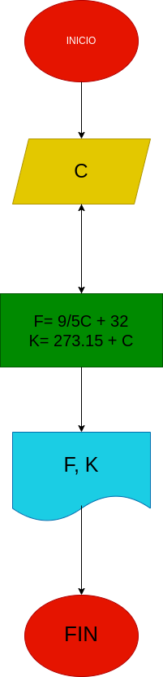

# EJERCICIO N°2

# Temperatura

## Programa para realizar conversiones de temperatura.

# ANALISIS

Variables de entrada (imput)

C: Grados centigrados

Variables de proceso y salida (processing, storage, output)

F: Grados farenheit

K: Grado kelvin

# DISEÑO

# CONSTRUCCION
